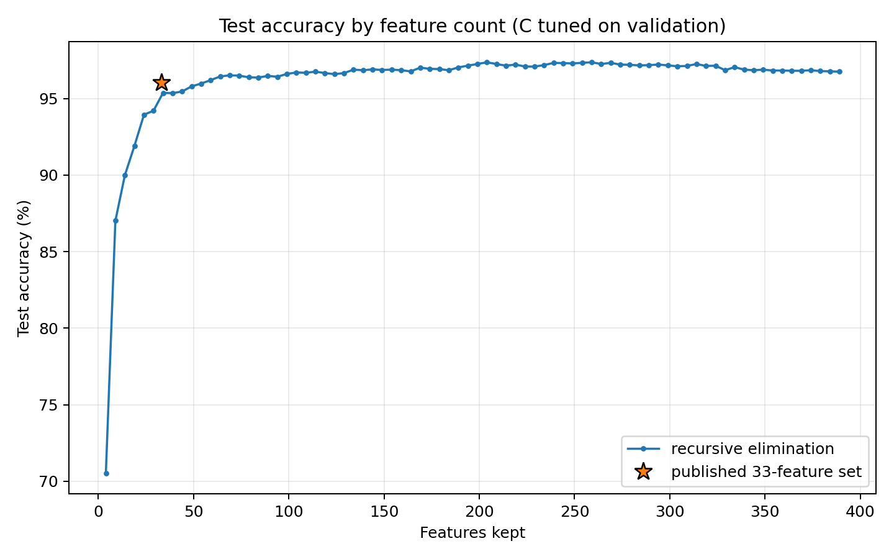
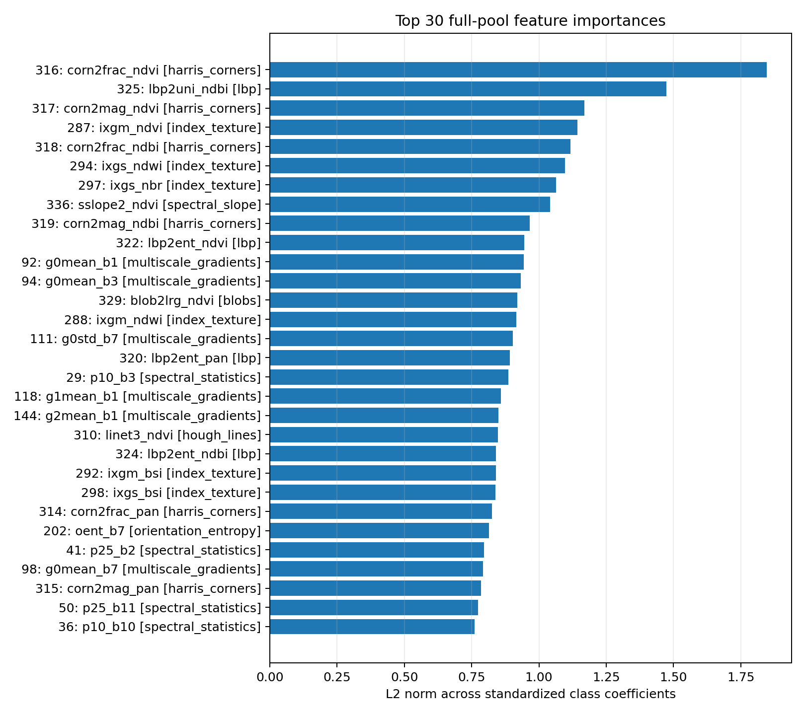

# Recorded full-pool importance results

The reference run retunes `C` on validation at every retained-feature count before scoring the selected fit and using its coefficients for the next removal. The complete 389-feature model selects `C=0.1` and reaches 96.69% validation and 96.76% test accuracy. The highest validation point retains 224 features, selects `C=1`, and reaches 97.06% validation and 97.09% test. The curve remains above 96% validation through 59 features, where `C=10` gives 96.02% validation and 96.20% test; the next point at 54 features scores 95.56% validation and 95.98% test.

The exact published 33-feature set is evaluated separately because it is not a point on the recursive path. Its independent sweep selects `C=3` and reproduces the frozen 306-parameter result exactly: 96.17% validation and 96.04% test. This is substantially stronger than the recursive path's nearby 34-feature subset, demonstrating that the curated 33-feature combination is not recovered by simple coefficient elimination.

| Curve point | Features | Reference-class parameters | C | Validation | Test |
|---|---:|---:|---:|---:|---:|
| Full pool | 389 | 3,510 | 0.1 | 96.69% | 96.76% |
| Highest validation | 224 | 2,025 | 1 | 97.06% | 97.09% |
| Smallest with validation >=96% | 59 | 540 | 10 | 96.02% | 96.20% |
| Next elimination point | 54 | 495 | 10 | 95.56% | 95.98% |
| Exact published feature set | 33 | 306 | 3 | 96.17% | 96.04% |
| Nearby recursive subset | 34 | 315 | 300 | 94.69% | 95.37% |

The five strongest full-model standardized coefficient norms are `corn2frac_ndvi`, `lbp2uni_ndbi`, `corn2mag_ndvi`, `ixgm_ndvi`, and `corn2frac_ndbi`. The NDVI connected-component area feature `blob2lrg_ndvi` ranks 13th. Of the 12 newly included region-shape columns, `tail_aniso_low_ndvi` ranks highest at 62nd and remains active until the 134-to-129-feature elimination step.

These are conditional coefficient importances under correlated inputs. The test curve is reported for the prespecified elimination path but was not used to select `C`, feature removals, or the reported validation points.

