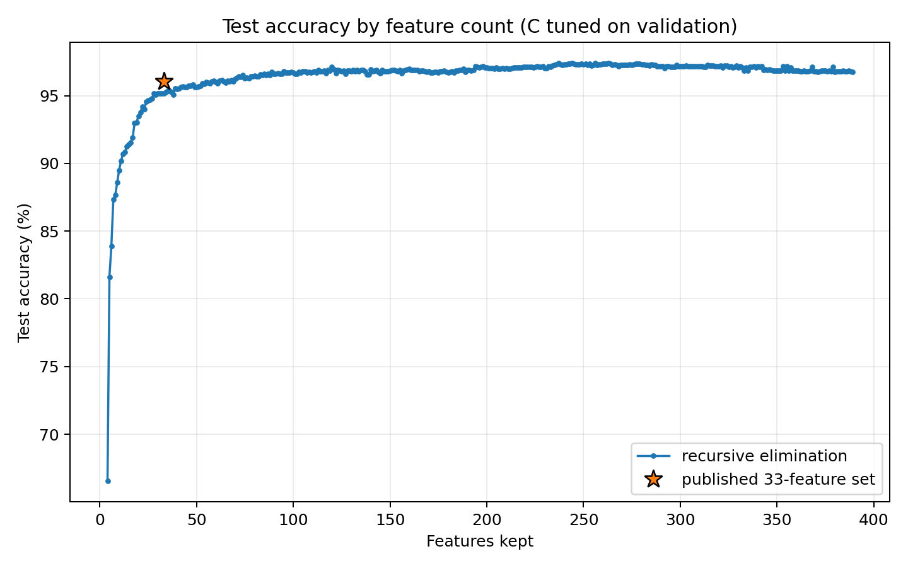

# Single-feature elimination results

This follow-up removes one feature per round from the 389-column pool and independently validation-tunes `C` at all 386 retained-feature counts. It uses the same train/validation/test splits, coefficient-importance definition, and nine-value `C` grid as the five-feature experiment under [`../results/`](../results/).

The validation-best point retains 234 features with `C=1`, reaching 97.07% validation and 97.22% test accuracy. The curve remains at or above 96% validation through 55 features, where `C=10` gives 96.02% validation and 96.00% test.

At exactly 33 features, the recursive subset selects `C=30` and reaches 94.83% validation and 95.17% test. The separately tuned published 33-feature set selects `C=3` and reaches 96.17% validation and 96.04% test, a test difference of 0.87 percentage points. The two sets share 15 columns; the recursive subset excludes 18 published columns, including `tail_aniso_low_ndvi`. This confirms that one-at-a-time coefficient elimination still follows a materially different path from the search that produced the published set.

| Point | Features | Reference-class parameters | C | Validation | Test |
|---|---:|---:|---:|---:|---:|
| Full pool | 389 | 3,510 | 0.1 | 96.69% | 96.76% |
| Highest validation | 234 | 2,115 | 1 | 97.07% | 97.22% |
| Smallest with validation >=96% | 55 | 504 | 10 | 96.02% | 96.00% |
| Recursive subset | 33 | 306 | 30 | 94.83% | 95.17% |
| Published feature set | 33 | 306 | 3 | 96.17% | 96.04% |

`scores.csv` contains all 386 curve points, `c_sweep.csv` contains all 3,474 regularization fits, `elimination_order.csv` records every removal, and `recursive33_features.csv` lists the exact recursive subset and its overlap with the published set.

